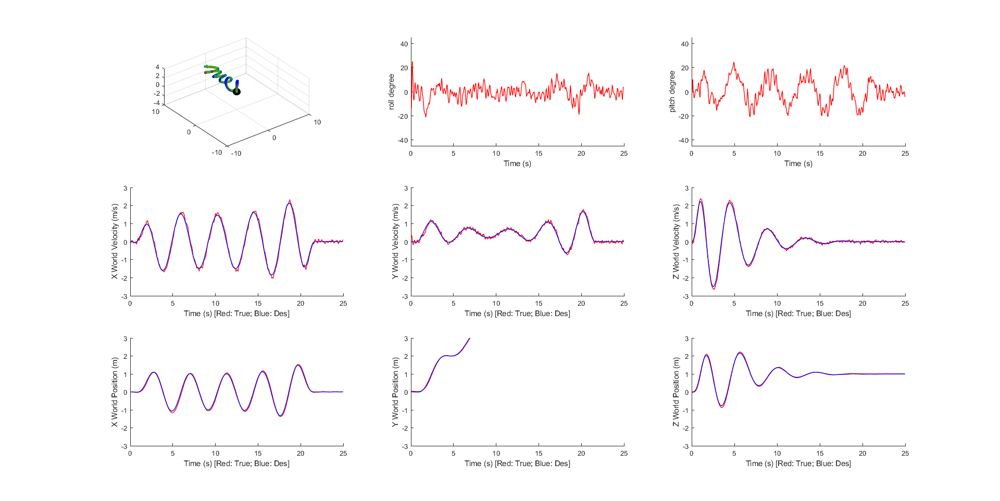

# minimum-snap 路径规划仿真

This repository is a minimum-snap simulation experiment written in MATLAB, which can be used to plan the path of a given trajectory point and give a 3D simulation image.

此仓库是以MATLAB写的minimum-snap仿真实验的作业，能够用于实现对给定轨迹点的路径进行规划，并给定3D仿真图像。

## 数学推导Mathematical derivation

minimum-snap具体推导可以参考

[https://github.com/symao/minimum_snap_trajectory_generation](https://github.com/symao/minimum_snap_trajectory_generation)

## 文件结构Structure

│  controller.m PD控制器
│  README.md
│  README.txt English profile
│  test_trajectory.m 主程序
│  trajectory_generator.m minimum-snap算法实现
├─readonly 工具包
│      quadEOM_readonly.m
│      quadModel_readonly.m
│      run_trajectory_readonly.m
└─utils 工具包
        quaternion_to_R.m
        QuatToRot.m
        RotToQuat.m
        RotToRPY_ZXY.m
        RPYtoRot_ZXY.m
        R_to_quaternion.m
        R_to_ypr.m
        ypr_to_R.m

## demo

Any problem, please contact [fayuepang@gmail.com](mailto:fayuepang@gmail.com)